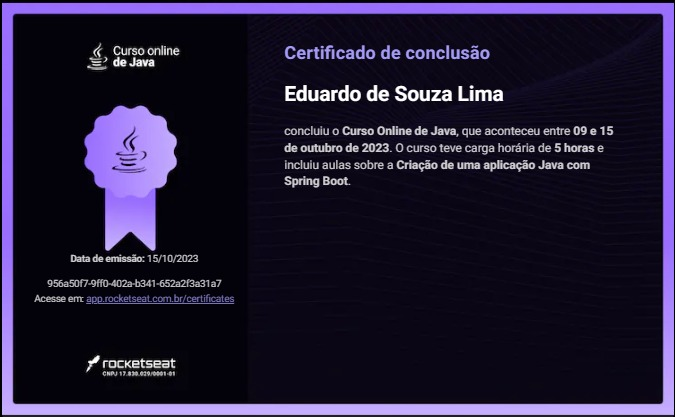

# Aplicação back-end de um TO-DO List
> Projeto construido do evento de Java da Rocketseat.
> - Construção da aplicação 
> - Integração com bando de dados 
> - Implementação de segurança
> - Atualizando tarefas e validando rotas
> - Com deploy do back-end

> Tecnologias
> - Java
> - Spring boot
> - Docker
> - Git e Github

## Contato
duduzx02@gmail.com

